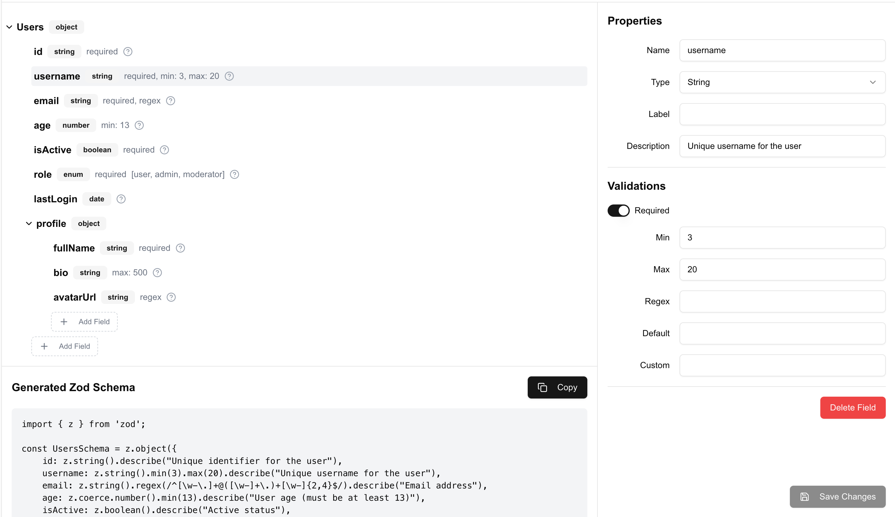

# Zod Schema Designer

The Zod Schema Designer is a powerful and flexible component for creating and editing Zod schemas visually. It can be easily integrated into any project using the shadcn CLI.

[Live Demo](https://zod-schema-designer.bishoylabib.com/)



## Features

- Visual schema editor with support for nested fields
- Properties panel for detailed field configuration
- Generated Zod schema code (optional)
- Support for various field types including string, number, boolean, array, object, enum, date, and calculated fields
- Customizable validation options
- Accepts both JSON and Zod schemas as initial input
- Outputs both JSON and Zod schemas

## Installation

Use the shadcn CLI to add the component:

```bash
npx shadcn@latest add https://raw.githubusercontent.com/Bishoymly/zod-schema-designer/main/registry/zod-schema-designer.json
```

This will add the ZodSchemaDesigner component and its dependencies to your project.

You can also install it manually by copying the component files from the [repository](https://github.com/Bishoymly/zod-schema-designer).

## Usage

Here's a comprehensive example of how to use the ZodSchemaDesigner component with both JSON and Zod schemas:

```jsx
import { useState } from 'react'
import { ZodSchemaDesigner } from "@/components/ui/zod-schema-designer"
import { z } from 'zod'
import { zodToJson, jsonToZod } from "@/components/ui/zod-schema-designer/schema-utils"

// JSON schema input
const initialJsonSchema = {
  name: 'User',
  type: 'object',
  children: [
    { name: 'id', type: 'string', validations: { required: true } },
    { name: 'username', type: 'string', validations: { required: true, min: 3, max: 20 } },
    { name: 'email', type: 'string', validations: { required: true, regex: '^[\\w-\\.]+@([\\w-]+\\.)+[\\w-]{2,4}$' } },
  ]
};

// Zod schema input
const initialZodSchema = z.object({
  id: z.string(),
  username: z.string().min(3).max(20),
  email: z.string().email(),
});

export default function SchemaEditor() {
  const [jsonSchema, setJsonSchema] = useState(initialJsonSchema);
  const [zodSchema, setZodSchema] = useState(initialZodSchema);
  const [useZodInput, setUseZodInput] = useState(false);

  const handleSave = (updatedSchema) => {
    // updatedSchema is always in JSON format
    setJsonSchema(updatedSchema);
    
    // Convert JSON schema to Zod schema
    const newZodSchema = jsonToZod(updatedSchema);
    setZodSchema(newZodSchema);

    console.log('Saved JSON schema:', updatedSchema);
    console.log('Saved Zod schema:', newZodSchema);
    // Handle the saved schema (e.g., send to server, update state, etc.)
  };

  return (
    <div>
      <button onClick={() => setUseZodInput(!useZodInput)}>
        Toggle Input: {useZodInput ? 'Zod' : 'JSON'}
      </button>
      <ZodSchemaDesigner
        initialSchema={useZodInput ? zodSchema : jsonSchema}
        onSave={handleSave}
        showGeneratedCode={true}
      />
    </div>
  );
}
```

## Setting an Initial Schema

You can set an initial schema using either a JSON object that follows the `SchemaField` type structure or a Zod schema:

```javascript
// JSON schema
const initialJsonSchema = {
  name: 'YourSchemaName',
  type: 'object',
  children: [
    { name: 'field1', type: 'string', validations: { required: true } },
    { name: 'field2', type: 'number', validations: { min: 0, max: 100 } },
    // Add more fields as needed
  ]
};

// Zod schema
const initialZodSchema = z.object({
  field1: z.string(),
  field2: z.number().min(0).max(100),
  // Add more fields as needed
});
```

Pass either `initialJsonSchema` or `initialZodSchema` to the `ZodSchemaDesigner` component as the `initialSchema` prop.

## Handling Output

The `onSave` function receives the updated schema in JSON format. If you need the Zod schema, you can convert it using the `jsonToZod` utility function:

```javascript
import { jsonToZod } from "@/components/ui/zod-schema-designer/schema-utils"

const handleSave = (updatedJsonSchema) => {
  // Handle JSON schema
  console.log('Updated JSON schema:', updatedJsonSchema);

  // Convert to Zod schema if needed
  const updatedZodSchema = jsonToZod(updatedJsonSchema);
  console.log('Updated Zod schema:', updatedZodSchema);

  // Use the schemas as needed (e.g., save to state, send to server, etc.)
};
```

## Saving the Schema

Here's an example of how to save the schema to a file:

```jsx
import { useState } from 'react'
import { ZodSchemaDesigner } from "@/components/ui/zod-schema-designer"
import { jsonToZod } from "@/components/ui/zod-schema-designer/schema-utils"

export default function SchemaEditor() {
  const [schema, setSchema] = useState(initialSchema);

  const handleSave = (updatedSchema) => {
    setSchema(updatedSchema);
    
    // Save JSON schema
    const jsonSchemaString = JSON.stringify(updatedSchema, null, 2);
    saveToFile(jsonSchemaString, 'schema.json');

    // Convert to Zod schema and save
    const zodSchema = jsonToZod(updatedSchema);
    const zodSchemaString = zodSchema.toString();
    saveToFile(zodSchemaString, 'schema.zod.ts');
  };

  const saveToFile = (content, filename) => {
    const blob = new Blob([content], { type: 'text/plain' });
    const url = URL.createObjectURL(blob);
    const link = document.createElement('a');
    link.href = url;
    link.download = filename;
    document.body.appendChild(link);
    link.click();
    document.body.removeChild(link);
    URL.revokeObjectURL(url);
  };

  return (
    <ZodSchemaDesigner
      initialSchema={schema}
      onSave={handleSave}
      showGeneratedCode={true}
    />
  );
}
```

This example will save both JSON and Zod representations of the schema when the user clicks the "Save Changes" button.

## Props

The `ZodSchemaDesigner` component accepts the following props:

- `initialSchema` (SchemaField | z.ZodType): The initial schema to be edited. Can be either a JSON object following the SchemaField structure or a Zod schema.
- `onSave` (function): A callback function that is called with the updated schema (in JSON format) when changes are saved.
- `showGeneratedCode` (boolean, optional): Whether to show the generated Zod schema code. Defaults to `true`.

## Customization

The Zod Schema Designer can be customized to fit your project's needs. You can modify the styling by editing the component's CSS or by overriding the shadcn UI components used within the designer.

## Contributing

Contributions are welcome! Please feel free to submit a Pull Request.

## License

This project is licensed under the MIT License.

